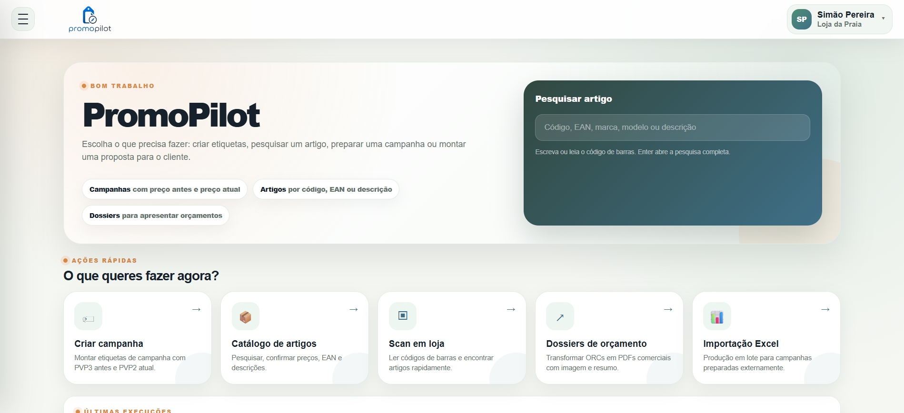
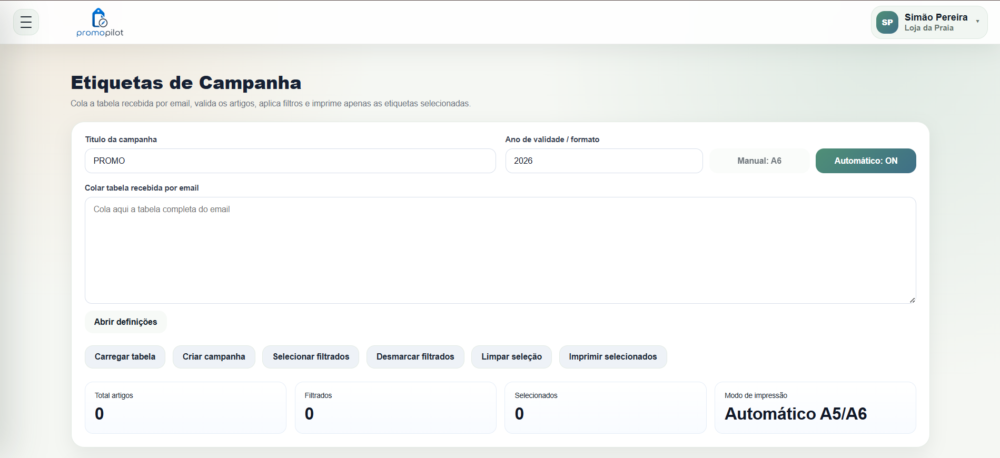
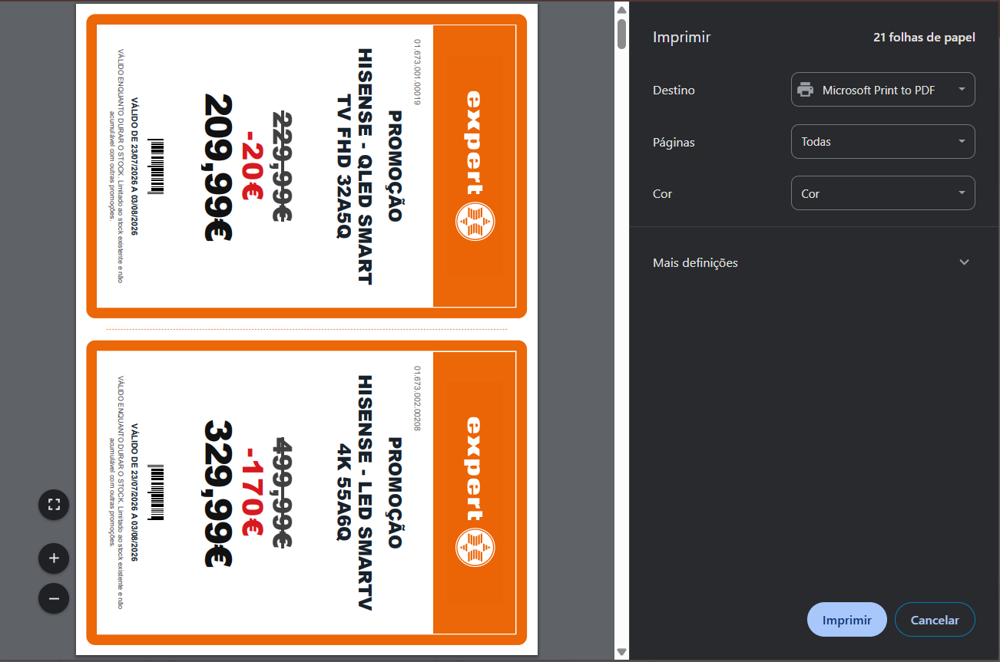
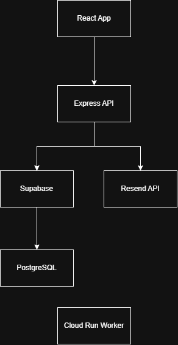

# PromoPilot


PromoPilot is a production-ready SaaS platform that helps retail teams create promotional campaigns, generate product labels, manage product catalogues and automate commercial workflows.

## 🌐 Live Demo

**https://promopilot.pt**

## Screenshots

### Dashboard



### Campaign Creation



### Labels



### Commercial Dossier


## Highlights

- Built entirely from scratch
- Production-ready SaaS
- Multi-tenant architecture
- Cloud deployed
- Secure authentication & authorization
- Used by real users

## Key Features

- Promotional campaign management
- Automatic label generation
- Product catalogue
- Commercial dossier generation
- Authentication & authorization
- Multi-tenant architecture
- Audit logging
- Email automation
- PDF generation
- REST API
- Cloud deployment

## Tech Stack

Layer	Technologies
Frontend	React, JavaScript, CSS, Tailwind CSS
Backend	Node.js, Express
Database	PostgreSQL, Supabase
Cloud	Google Cloud Run, Render
Authentication	Supabase Auth
Integrations	Resend, Playwright

## Architecture



## Security

- Row Level Security
- Tenant isolation
- Server-side secret management
- Authentication middleware
- Rate limiting
- Webhook validation

## Running Locally

```bash
git clone https://github.com/simaoopp/promopilot.git

cd promopilot

npm install

cp .env.example .env

npm run dev
```

## Why I Built It

PromoPilot was created to simplify the process of managing promotional campaigns for retail businesses.

The goal was to build a production-ready SaaS application capable of handling authentication, multi-tenancy, cloud deployment, PDF generation and email automation while maintaining a scalable architecture.

## License

MIT